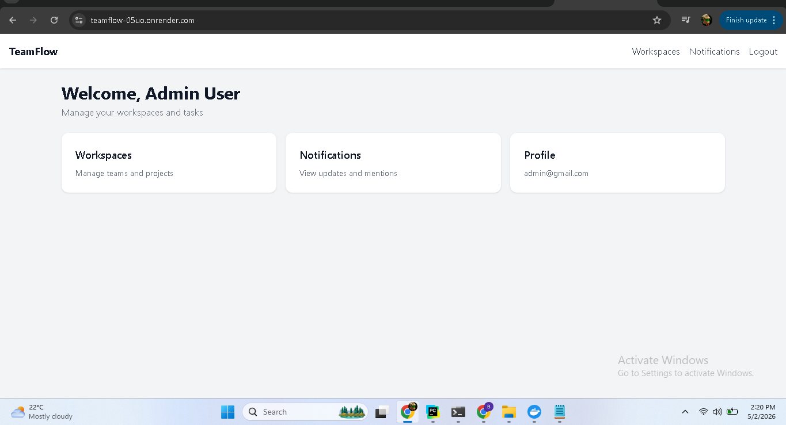
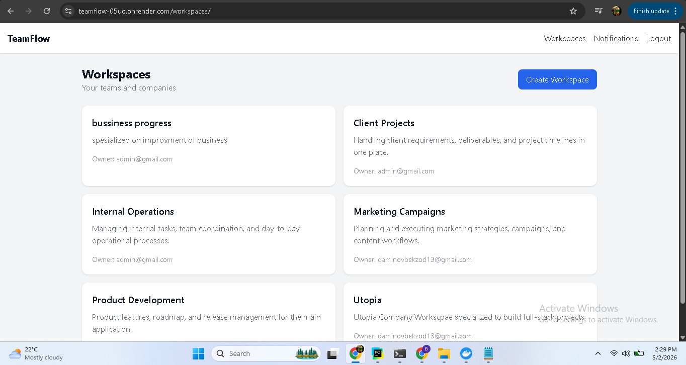
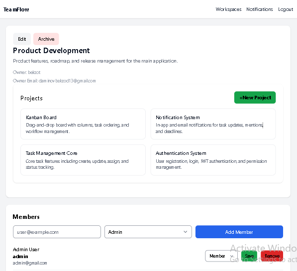
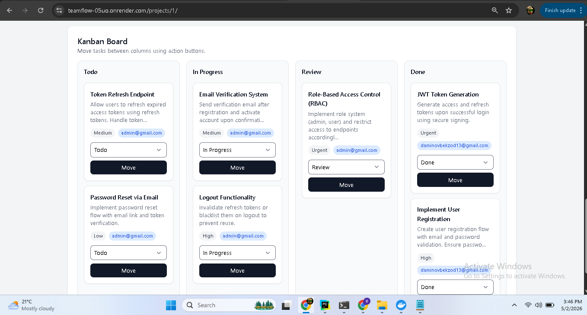
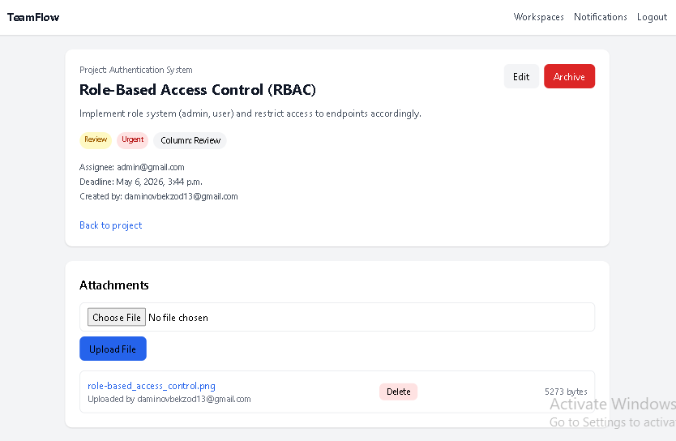
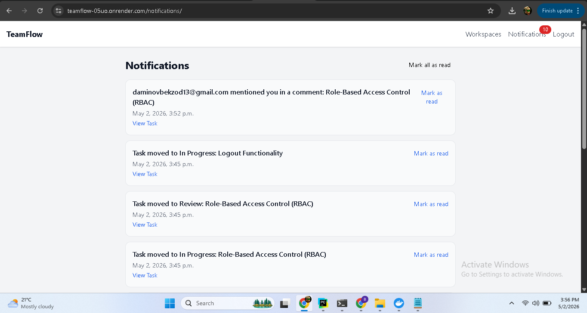
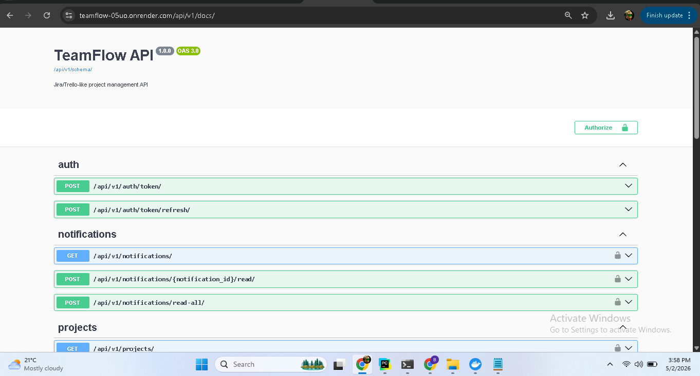
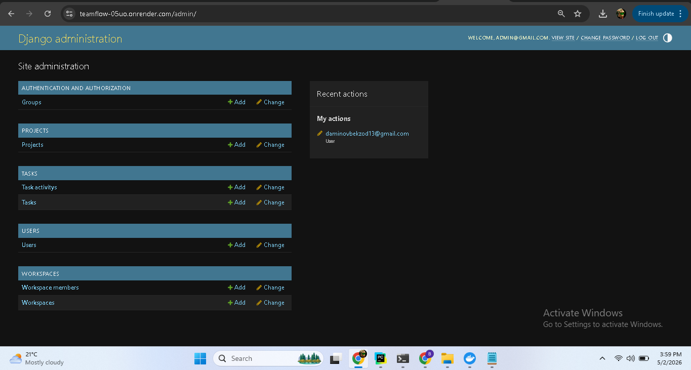

## Live Demo

🌐 https://teamflow-05uo.onrender.com

Admin panel:
https://teamflow-05uo.onrender.com/admin/

API Docs:
https://teamflow-05uo.onrender.com/api/v1/docs/

## Celery (Async Tasks)

Celery and Redis are configured for:
- email notifications
- deadline reminders

⚠️ Note:
Background workers require a paid instance on Render.
Locally, Celery runs via Docker.

## Screenshots

### Dashboard

### Workspaces

### Projects

### Kanban Board

### Task Detail

### Notifications

### API Docs

### Admin
